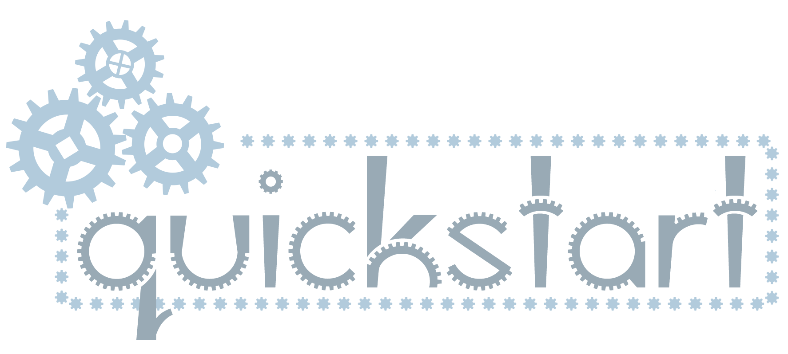

#**Inviting**
First you want to do is add GearBot to your server. Unlike regular users a normal invite link can't be used by bots but you can add GearBot  to your server by following this link: <https://discordapp.com/oauth2/authorize?client_id=349977940198555660&scope=bot&permissions=268788822>.
There you will be able to pick what server you want to add GearBot to as well it will list the permission GearBot will be granted (as he'll need those for different things to work).


If GearBot has been on the server before it will continue on where it left of before and he will re-use the configurations he already has.

To run any configuration commands you need permission lvl 3 (admin) or higher, see the advanced guide for details, for now it's enough to know that by default you have this if you are the server owner or have a role with the"administrator" permission enabled. If all people who you want to be able to reconfigure GearBot have admin perms, and all moderators have ban permissions: Congrats you are done for this bit and can skip ahead!

#**Prefix**
GearBots default prefix is ``!`` but this is one used by many bots, if you have any other bots that also reply to this you can give GearBot a new prefix (if you are a lvl 3 (admin) person, see the [Advanced permissions guide](Permissions.md))!
It will also respond to you mentioning him (``@GearBot#7326``) instead of using ``!`` regardless of his configured server prefix.

Anyways, here's the command, just replace ``<prefix>`` with what you want GearBot to respond to (unless you want GearBot to respond to ``<prefix>``, if so that's fine, don't replace it):
```
!configure prefix <prefix>
``` 

If you changed GearBots prefix please replace ``!`` with the new prefix in further commands, for this guide all of the commands will be using my default prefix.

Don't remember GearBots prefix? No problem, he can tell you what it is if you don't give him a new one:
```
@GearBot#7326 configure prefix
```

If for some reason this is not the case you will have to tell GearBot what the admin and mod roles are. Please replace ``<role>`` with the actual role name (case sensitive) or ID (can be gotten with the ``!roles`` command)

To add a role as mod role:
```
!configure mod_roles add <role>
```

If you no longer want a role to be considered a modrole (keep in mind this is seperate from roles with ban permissions, those people will GearBot always consider to be mods):
```
!configure mod_roles remove <role>
```

For admin roles the process is similar:
```
!configure admin_roles add <role>
```
and
```
!configure admin_roles remove <role>
```


#**Logging**

GearBot has 3 types of logging and they can all be pointed to the same channel or different ones, that's up to you.
In all these commands please replace ``<channel>`` with the actual channel, either a #mention or ID works for him.

##__*Join logs*__
It's always good to know who comes and goes, for this GearBot can log whenever people join or leave the server:
```
!configure joinLogChannel <channel>
```
Don't want him to log it anymore for some reason? No worries, you can tell him to stop at any time:
```
!disable joinLogChannel
```

##__*Minor logs*__
People are sneaky, they can say bad things and then cover it up with edits or deleting before a moderator shows up. But GearBot sees everything and can log those edits and deleted messages for you.
```
!configure minorLogChannel <channel>
```
You can of course disable this again later as well:
```
!disable minorLogChannel
```


##__*Mod logs*__
And last but definitely not least: the all important mod logs, this is where he logs the really imporant stuff (kicks/bans/warnings/...)
```
!configure modLogChannel <channel>
```
And disabling is equally easy (but not recommended at all):
```
!disable modLogChannel
```